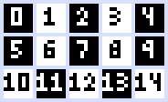

# Getting Started in Rust

### Synopsis
`spf.rs` brings the world of SimplePixelFont(s) into the programming realm. Written in the Rust
programming language, spf.rs aims to be effective and simple to use, providing a native crate api for
Rust and also an FFI compatible with C-like languages and C-interopable languages. It provides a
low-level interface to the binary representation of `SimplePixelFont` files via the [`crate::core`]
module. And includes helpful and powerful optional modules that allow integration to be faster for your
projects.

### Resources
It is important that before you begin you have a general understanding of the Rust programming
languages and that you understand at the bare-minimum how `SimplePixelFont` files are structured.
This guide will explain the structural representation of `SimplePixelFont` files in Rust which aims to
reflect the binary structure, so you should be able to follow along eitherways.

### The [`crate::core`] module
The most important module is the [`crate::core`] module, and it contains the lowest-level structures to
represent a `SimplePixelFont` file. The most important struct is the [`core::Layout`] struct, which is
the binary representation of a `SimplePixelFont` file as a Rust Structure. Lets take a look at an
example of a font [`core::Layout`] struct:

```rs
Layout {
    header: Header { //Header Properties
        configuration_flags: ConfigurationFlags {
            alignment: true // Font will be alligned by Height
        },
        modifier_flags: ModifierFlags {
            compact: true // Strips any padding bytes when converting struct to data.
        },
        required_values: RequiredValues {
            constant_size: 3 // Each character in this font will have a height of 3, note how this is because the font is alligned by height.
        }
    },
    body {
        characters: vec![ // Includes each chatacter
            Character {
                utf8: 'w', // A valid utf8 character
                custom_size: 5, // Each character can have a custom size which is opppsite to the alignment constant_size. In this case 5 is the width of the character.
                byte_map: vec![ //The pixels of the character. 0 means an empty pixel.
                    1, 0, 1, 0, 1,
                    1, 0, 1, 0, 1,
                    1, 1, 1, 1, 1]
            }
        ]
    }
}
```

This is a lot to take in, luckily in Rust we dont need to write a [`core::Layout`] struct
directly, instead we turn to the [`crate::ergonomics`] module which provides the
[`ergonomics::LayoutBuilder`] struct. Keep in mind that the [`crate::ergonomics`] module is only
availible in Rust. Lets use the [`ergonomics::LayoutBuilder`] to create the same
[`core::Layout`] struct we have above:

```rs
use spf::ergonomics::*;

...

let mut font = LayoutBuilder::new()
    .alignment(ALIGNMENT_HEIGHT)
    .size(3)
    .infferred('w', &[
        1, 0, 1, 0, 1,
        1, 0, 1, 0, 1,
        1, 1, 1, 1, 1
    ])
    .build().unwrap();
```

This is a lot more easier to read and understand, so now lets explain each method:
`.alignment(ALIGNMENT_HEIGHT)` This method will set the font to have characters aligned by height.
What does this mean? By having the alignment set to height each character must have the same height
which is determined by the following method `.size(3)` which sets the [`RequiredValues::constant_size`]
field of the font's [`core::RequiredValues`] struct. Note that 255x255 (width x height) is currently
the largest possible character within a `SimplePixelFont` font file. Now that the
[`ergonomics::LayoutBuilder`] has a defined `RequiredValues::constant_size` and
[`ConfigurationFlags::alignment`] we can add characters to our font using the
[`LayoutBuilder::character()`] or the [`LayoutBuilder::inffered()`] method as used in the sample
above.

Side Note: To learn more about the different configuration flags and modifier flags, check out the
[SPF File Specifications](https://github.com/SimplePixelFont/Specification).

### But what is a character in `SimplePixelFont`s?
Before we dicuss how to add a character to our font, we first need to learn what a character is in the
context of a `SimplePixelFont` font.

In simple terms a character in `SimplePixelFont` is simply a utf8 character such as `a`, `<` `😊`, etc.
A [`Character::custom_size`] which defines the length of the opposite dimension the
[`RequiredValues::constant_size`] size defines. And a [`Character::pixmap`] that defines what pixels
the character uses. Lets dig in more into a pixmap. A pixmap is simply a one dimentional vector
containing either 0 or 1 values (at the moment). If the value something other than 0 the character uses
the pixel, if it is 0 then the character does not. Lets take a look at an example to clarify
everything:

```rs
Character {
    utf8: 'w', // A valid utf8 character
    custom_size: 5, // Each character can have a custom size which is opppsite to the alignment constant_size. In this case 5 is the width of the character.
    pixmap: vec![ // Bitmap data
        1, 0, 1, 0, 1,
        1, 0, 1, 0, 1,
        1, 1, 1, 1, 1
    ]
}

```

In particular the pixmap shown above can be rewritten as a vector in a single line:

```rs
vec![ 1, 0, 1, 0, 1, 1, 0, 1, 0, 1, 1, 1, 1, 1, 1]
```

Now we can see that in `SimplePixelFont` [`Character::pixmap`] are defined from top-left corner pixel
and continue until the rightmost pixel before going down the next row. Here is a diagram which maps
each pixel of a character to their index in the pixmap vector:



And this will result in the following character:


### Font Example

We can define as many characters using the [`ergonomics::LayoutBuilder`] and the
[`LayoutBuilder::character()`] method or the [`LayoutBuilder::inffered()`] method. Here is an example
of a font with 3 characters and a [`RequiredValues::constant_size`] of 4:

```rs
let mut font = LayoutBuilder::new()
    .alignment(ALIGNMENT_HEIGHT)
    .size(4)
    .inffered('o', &[
        1, 1, 1, 1,
        1, 0, 0, 1,
        1, 0, 0, 1,
        1, 1, 1, 1,
    ])
    .inferred('w', &[
        1, 0, 1, 0, 1,
        1, 0, 1, 0, 1,
        1, 0, 1, 0, 1,
        1, 1, 1, 1, 1,
    ])
    .character('😊', 4, &[
        0, 1, 1, 0,
        0, 0, 0, 0,
        1, 0, 0, 1,
        0, 1, 1, 0,
    ])
    .build();
```

The difference between the [`LayoutBuilder::inffered()`] method and the [`LayoutBuilder::character()`]
method is the the [`LayoutBuilder::character()`] method explicitly needs the [`Character::custom_size`
of the character, whilst the [`LayoutBuilder::inffered()`] method will infer the
[`Character::custom_size`] based on the [`core::Layout`]'s [`RequiredValues::constant_size`].

### Saving & Loading `spf.rs` fonts with [`std::fs`]

We can then encode the struct and use [`std::fs`] to write to a file:

```rs
let mut file = std::fs::OpenOptions::new()
    .write(true)
    .create(true)
    .open("./sampleToyFont.spf")
    .unwrap();
file.write_all(&layout_to_data(&font).unwrap());
```

Or we can load an exsisting .spf file using [`std::fs`] aswell:

```rs
let mut file = std::fs::OpenOptions::new()
    .read(true)
    .open("./sampleToyFont.spf")
    .unwrap();
let mut buffer: Vec<u8> = vec![];
file.read_to_end(&mut buffer).unwrap();
let font = layout_from_data(buffer);
```
